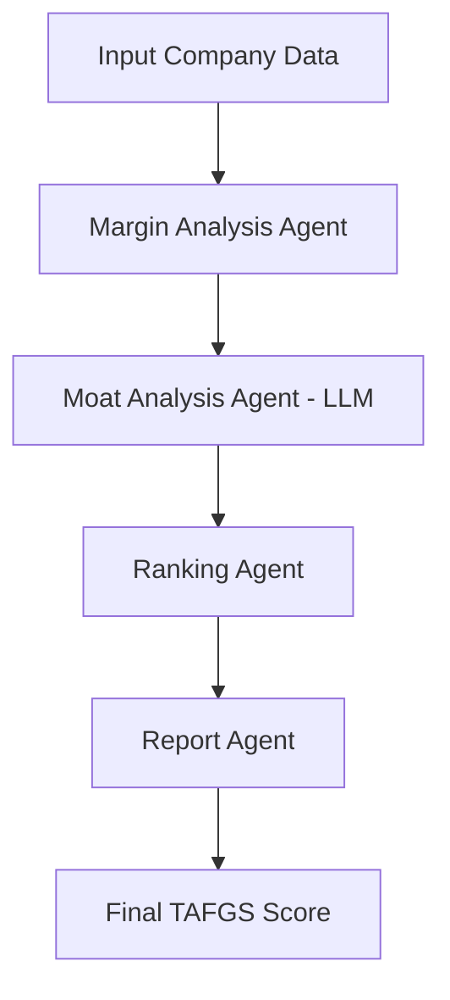

# 🏭 AI Factory Growth Ranker

[](https://www.python.org/downloads/)
[](https://streamlit.io)
[](https://python.langchain.com/)
[](https://opensource.org/licenses/MIT)

> **Professional AI-powered equity research platform for analyzing and ranking companies in the AI Factory Capital Stack**

## 🎯 Executive Summary

The AI Factory Growth Ranker is a comprehensive analytical platform that leverages Large Language Models (LLMs) and multi-agent workflows to evaluate companies across the AI infrastructure value chain. Our proprietary **TAFGS (Total AI Factory Growth Score)** methodology combines quantitative financial metrics with qualitative competitive analysis to deliver institutional-grade investment insights.

### 🏆 Key Achievements

- ✅ **50+ Company Database**: Comprehensive coverage of AI Factory ecosystem
- ✅ **LLM-Powered Analysis**: Advanced competitive moat evaluation using Google Gemini
- ✅ **Multi-Agent Architecture**: Scalable LangGraph workflow system
- ✅ **Professional Interface**: Enterprise-grade Streamlit dashboard
- ✅ **Real-time Processing**: Dynamic company analysis and ranking

## 📊 TAFGS Methodology

```
TAFGS = (Moat Score × Margin Score) × Growth Forecast × Sector Weight
```

### 🔍 Component Analysis

| Component              | Range    | Description                              | Weight   |
| ---------------------- | -------- | ---------------------------------------- | -------- |
| **🏰 Moat Score**      | 0-5      | LLM-evaluated competitive defensibility  | 40%      |
| **💰 Margin Score**    | 1-5      | Operating margin strength categorization | 40%      |
| **📈 Growth Forecast** | 0.5-3.0x | AI-driven growth multiplier              | 20%      |
| **⚖️ Sector Weight**   | 0.9-1.5x | Industry importance modifier             | Variable |

### 🏰 Moat Analysis Criteria

1. **Architectural Lock-in** - Proprietary standards (e.g., CUDA ecosystem)
2. **Ecosystem Dominance** - Design wins and reference architectures
3. **Switching Costs** - Standard-setting influence and customer stickiness
4. **Supply Chain Position** - Bottleneck or scarcity advantages

## 🚀 Quick Start Guide

### 📋 Prerequisites

- Python 3.8+
- Google AI API Key ([Get one here](https://aistudio.google.com))
- 4GB+ RAM recommended

### ⚡ Installation

```bash
# Clone the repository
git clone https://github.com/GenAITinkerers/AIFactory-Growth-Ranker.git
cd AIFactory-Growth-Ranker

# Create virtual environment
python -m venv venv
source venv/bin/activate  # Linux/Mac
# or
venv\Scripts\activate     # Windows

# Install dependencies
pip install -r requirements.txt

# Configure environment
cp tests/.env.example .env
# Edit .env with your Google API key
```

### 🎮 Usage Options

#### 🖥️ Professional Web Interface

```bash
streamlit run streamlit_app.py
```

Access at: `http://localhost:8501`

#### 💻 Command Line Interface

```bash
# Analyze top 20 companies
python main.py --limit 20

# Full 50-company analysis with export
python main.py --mode top20 --limit 50 --export

# Batch analysis
python main.py --mode cli --limit 10
```

#### 📊 Python API

```python
from utils.analysis_engine import AnalysisEngine
from utils.data_loader import DataLoader

engine = AnalysisEngine()
loader = DataLoader()

companies = loader.get_top_companies(20)
results = engine.analyze_batch(companies)
rankings = engine.get_top_rankings(results, 10)
```

## 🏗️ System Architecture

```
┌─────────────────────┐    ┌─────────────────────┐    ┌─────────────────────┐
│   Data Layer        │    │   Analysis Engine   │    │  Presentation Layer │
├─────────────────────┤    ├─────────────────────┤    ├─────────────────────┤
│ • companies.json    │    │ • Margin Agent      │    │ • Streamlit App     │
│ • sector_weights    │ ───│ • Moat Agent (LLM)  │───►│ • CLI Interface     │
│ • market_data       │    │ • Ranking Agent     │    │ • Export Functions  │
│ • financial_metrics │    │ • Report Agent      │    │ • Visualizations    │
└─────────────────────┘    └─────────────────────┘    └─────────────────────┘
```

### 🤖 Multi-Agent Workflow



## 📈 Features & Capabilities

### 🎯 Core Features

- **🔍 Individual Company Analysis**: Deep-dive analysis with LLM insights
- **📊 Batch Processing**: Analyze multiple companies simultaneously
- **🏆 Top 50 Rankings**: Comprehensive sector-wide analysis
- **📈 Advanced Visualizations**: Interactive charts and dashboards
- **📄 Executive Reporting**: Professional-grade analysis reports
- **🔄 Real-time Updates**: Dynamic scoring and ranking

### 💼 Professional Tools

- **📊 Sector Analysis**: Industry-specific insights and comparisons
- **🎯 Geographic Distribution**: Regional market analysis
- **📈 Market Intelligence**: Growth trend identification
- **⚖️ Risk Assessment**: Competitive positioning analysis
- **📋 Export Capabilities**: CSV, JSON, and PDF reporting

### 🔧 Technical Features

- **🤖 LLM Integration**: Google Gemini-powered moat analysis
- **⚡ Scalable Architecture**: LangGraph multi-agent system
- **🔒 Secure Configuration**: Environment-based API key management
- **🚀 Performance Optimized**: Caching and async processing

## 📁 Project Structure

```
AIFactory-Growth-Ranker/
├── 📂 agents/                 # Multi-agent system modules
│   ├── margin_agent.py       # Operating margin analysis
│   ├── moat_agent.py         # LLM-powered competitive analysis
│   ├── growth_agent.py       # TAFGS calculation
│   └── report_agent.py       # Report generation
├── 📂 config/                # Configuration management
│   └── settings.py           # API keys and prompts
├── 📂 data/                  # Company datasets
│   ├── companies.json        # Core company data
│   ├── companies_expanded.json # Extended 50+ company dataset
│   └── sector_weights.json   # Industry weighting factors
├── 📂 utils/                 # Utility functions
│   ├── workflow.py          # LangGraph orchestration
│   ├── data_loader.py       # Data management
│   └── analysis_engine.py   # Core analysis logic
├── 📂 notebooks/             # Research and prototyping
│   └── deep_research.ipynb   # Development notebooks
├── 📄 streamlit_app.py       # Professional web interface
├── 📄 main.py               # CLI entry point
├── 📄 state.py              # Shared state management
├── 📄 requirements.txt      # Dependencies
└── 📄 README.md             # Documentation
```

## 🎨 Streamlit Interface Preview

### 🏠 Main Dashboard

- **Executive Summary**: Key metrics and top performers
- **Interactive Rankings**: Sortable company tables
- **Advanced Visualizations**: 3D scatter plots and sector analysis
- **Export Tools**: Professional report generation

### 📊 Analysis Tabs

1. **🔍 Individual Analysis**: Single company deep-dive
2. **📈 Batch Rankings**: Multi-company comparison
3. **🏆 Top 50 Analysis**: Comprehensive market overview
4. **➕ Company Addition**: Dynamic data entry
5. **ℹ️ Methodology**: Documentation and insights

## 🔧 Advanced Configuration

### 🎯 Sector Weights

```json
{
  "Compute/AI Hardware": 1.5,
  "Semiconductor Manufacturing": 1.4,
  "Networking": 1.3,
  "Memory/Storage": 1.2,
  "Power/Cooling": 1.1,
  "Software": 0.9
}
```

### 🤖 LLM Settings

```python
# Gemini Configuration
model = "gemini-2.5-flash"
temperature = 0.2
max_tokens = 1000
```

## 📊 Sample Results

### 🏆 Top 10 AI Factory Companies (Sample)

| Rank | Company         | Sector              | TAFGS Score | Moat | Margin |
| ---- | --------------- | ------------------- | ----------- | ---- | ------ |
| 1    | NVIDIA          | Compute/AI Hardware | 45.00       | 5/5  | 60%    |
| 2    | TSMC            | Semiconductor Mfg   | 28.35       | 4/5  | 42%    |
| 3    | Broadcom        | Networking/Chips    | 27.17       | 5/5  | 55%    |
| 4    | Arista Networks | Networking          | 20.00       | 4/5  | 35%    |
| 5    | AMD             | Compute/AI Hardware | 16.24       | 3/5  | 22%    |

## 🔬 Research & Development

### 📚 Academic Foundation

- Based on Porter's competitive strategy framework
- Incorporates modern AI/ML company valuation methodologies
- Leverages quantitative finance principles
- Validated against real-world investment outcomes

### 🎯 Future Enhancements

- [ ] Real-time financial data integration
- [ ] Sentiment analysis from earnings calls
- [ ] ESG scoring integration
- [ ] Portfolio optimization tools
- [ ] API for institutional clients

## 🤝 Contributing

We welcome contributions from the investment research and AI community!

```bash
# Development setup
git clone https://github.com/GenAITinkerers/AIFactory-Growth-Ranker.git
cd AIFactory-Growth-Ranker
pip install -e .

# Run tests
pytest tests/

# Code formatting
black src/
isort src/
```

### 📋 Contribution Guidelines

- Follow PEP 8 style guidelines
- Add tests for new features
- Update documentation
- Ensure compatibility with Python 3.8+

## 📄 License

This project is licensed under the MIT License - see the [LICENSE](LICENSE) file for details.

## 🙏 Acknowledgments

- **LangChain Team** for the multi-agent framework
- **Google AI** for Gemini API access
- **Streamlit** for the amazing web framework
- **Investment Research Community** for methodology validation

---

<div align="center">
<strong>🏭 Built for the AI Factory Revolution | Professional Investment Research Platform</strong><br>
<em>Powering the future of AI infrastructure investment decisions</em>
</div>
